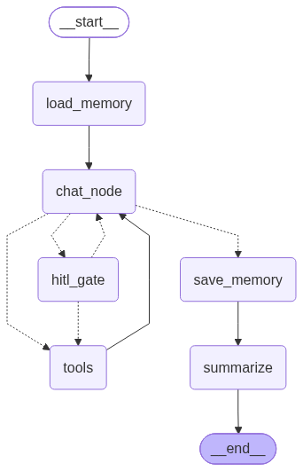

# LangGraph Agentic Chatbot

A chatbot project I built while learning **Agentic AI with LangGraph**.

Instead of learning each concept separately and leaving them as isolated examples, I wanted to bring the concepts I learned together into one working chatbot. This project combines **tool calling, RAG, human-in-the-loop approval, short-term memory, and long-term memory** into a single LangGraph workflow.

The main goal of this project was to understand how these concepts work individually and, more importantly, how they can be combined to build an agentic application.

## The Graph



The graph above shows the complete workflow of the chatbot, including tool calling, human-in-the-loop approval, memory, summarization, and the agent loop.

---

## Concepts Used

### Tools — `backend/tools.py`

The chatbot can call external tools when it needs information or capabilities that the LLM cannot reliably provide on its own.

Currently, the available tools include:

* Weather
* Stock prices
* Currency exchange rates
* Current date
* Web search
* Python code execution

The LLM decides when a tool is actually needed instead of trying to answer everything from its existing knowledge.

---

### RAG — `backend/rag.py`

RAG allows the chatbot to answer questions using files uploaded by the user instead of relying only on the LLM's knowledge.

Supported file types:

* PDF
* TXT
* Markdown

The uploaded files are split into smaller chunks, converted into embeddings, and stored in **PostgreSQL using pgvector**.

When the chatbot needs information from the uploaded documents, the RAG workflow:

1. Retrieves relevant chunks.
2. Grades the retrieved chunks for relevance.
3. Removes irrelevant chunks.
4. Uses the remaining context to generate the answer.

The RAG pipeline itself is implemented as a small LangGraph subgraph.

---

### Human-in-the-Loop — `backend/agent.py` → `hitl_gate`

Some tools can be more sensitive than others. In this project, **Python code execution** requires human approval before it can run.

When the agent decides that Python execution is required, the graph pauses using LangGraph's `interrupt()`.

The Streamlit UI then shows **Approve** and **Reject** options.

* **Approve** → the tool is executed.
* **Reject** → the tool is not executed and the conversation continues.

This helped me understand how LangGraph can pause and resume an agent workflow based on a human decision.

---

### Short-Term Memory — `backend/config.py` + `backend/summarization.py`

Short-term memory handles the conversation context within a chat.

LangGraph's **checkpointer** stores the conversation state, allowing a chat to survive things such as a page refresh.

However, keeping the complete conversation forever would eventually make the context too large. To handle this, older messages are summarized once the conversation becomes long.

The summary replaces the older messages while keeping the important context available to the agent.

---

### Long-Term Memory — `backend/config.py` + `backend/memory.py`

Long-term memory stores useful information that can be reused across **different conversations**.

Before generating a response, the chatbot searches its existing memories for information that may be relevant to the current conversation.

After responding, it checks whether the conversation contains something worth remembering and stores it only when necessary.

The system also checks for existing memories to avoid repeatedly storing the same information.

This makes long-term memory different from the short-term conversation state handled by LangGraph's checkpointer.

---

## Putting It Together — `backend/graph.py`

`graph.py` connects all the individual components into the main LangGraph workflow.

The agent can:

* Answer directly when no additional capability is required.
* Call a safe tool and continue the agent loop.
* Pause for human approval before calling a risky tool.
* Use RAG when information is required from uploaded documents.
* Load relevant long-term memories before responding.
* Save new useful memories after the conversation.
* Summarize older conversation history when needed.

The purpose of the project was to understand how these individual Agentic AI concepts can work together as one system rather than as separate implementations.

---

## Project Structure

```text
backend/
├── config.py             # LLM, DB connection, embeddings, memory setup
├── state.py              # Chatbot state and system prompt
├── rag.py                # RAG subgraph and file upload handling
├── tools.py              # Tools available to the agent
├── memory.py             # Long-term memory
├── summarization.py      # Short-term memory summarization
├── agent.py              # Main agent logic and HITL approval
├── graph.py              # Main LangGraph workflow
└── threads.py            # Chat history, titles and renaming

app.py                    # Streamlit UI
graph/
└── graph.png             # LangGraph workflow diagram
```

---

## Tech Stack

* **LangGraph** — Agent workflow and orchestration
* **Groq (`openai/gpt-oss-120b`)** — LLM
* **Gemini Embeddings** — RAG and long-term memory embeddings
* **PostgreSQL + pgvector** — Database and vector storage
* **Streamlit** — Chat UI
* **Python** — Application development

---

## Running the Project

### 1. Install dependencies

```bash
pip install -r requirements.txt
```

### 2. Configure environment variables

Copy `.env.example` to `.env` and add the required API keys and database URL:

```env
DATABASE_URL=your_database_url
GROQ_API_KEY=your_groq_api_key
GOOGLE_API_KEY=your_google_api_key
OPENWEATHER_API_KEY=your_openweather_api_key
```

### 3. Enable pgvector

Run the following command in PostgreSQL:

```sql
CREATE EXTENSION IF NOT EXISTS vector;
```

### 4. Start the application

```bash
streamlit run app.py
```

### 5. Use RAG

To ask questions about an uploaded document:

1. Upload a PDF, TXT, or Markdown file from the sidebar.
2. Click **Ingest into RAG**.
3. Ask questions about the uploaded document.

---

## Purpose of the Project

This project is primarily a **learning project for understanding Agentic AI and LangGraph**.

While learning, I worked with concepts such as:

* LangGraph state and nodes
* Conditional routing
* Tool calling
* RAG
* Subgraphs
* Human-in-the-loop workflows
* `interrupt()`
* Checkpointing
* Short-term memory
* Long-term memory
* Conversation summarization

After learning these concepts individually, I combined them into this project to understand how they behave when used together in a real application.

The project is still something I can continue improving, but it gave me a much better understanding of how the different building blocks of an agentic system fit together.
